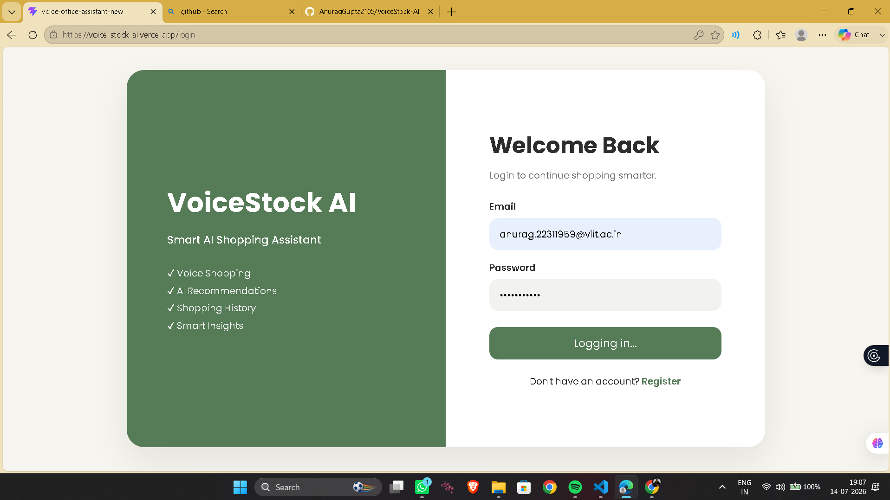
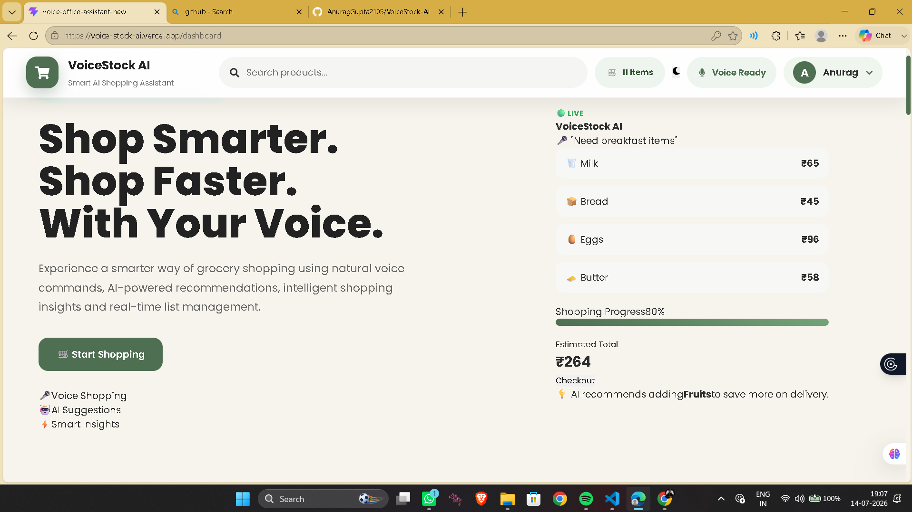
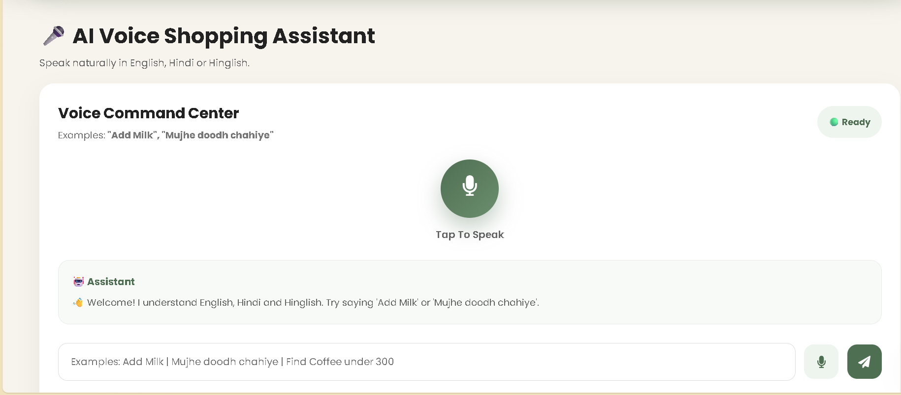
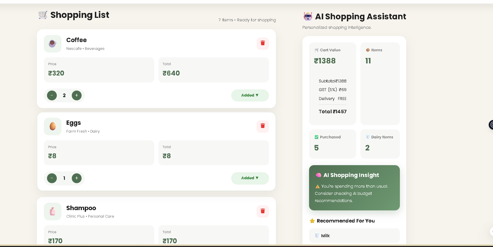
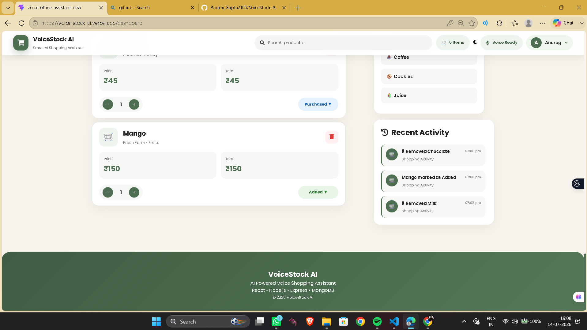

# 🎤 VoiceStock AI

An AI-powered Voice Shopping Assistant that allows users to manage their shopping list using voice commands in **English, Hindi, and Hinglish**. The application uses Natural Language Processing (NLP) to understand user commands, provides smart product recommendations, seasonal suggestions, and substitute products while maintaining a personalized shopping experience.

---

# 🚀 Live Demo

### 🌐 Deployed Application

👉 **https://voice-stock-ai.vercel.app/dashboard**

---

# 📂 GitHub Repository

👉 **https://github.com/AnuragGupta2105/VoiceStock-AI**

---

# 📖 Project Overview

VoiceStock AI is a smart shopping assistant that enables users to interact with their shopping list through voice commands. Instead of typing product names manually, users can simply speak commands like:

- Add Milk
- Buy Bread
- Mujhe doodh chahiye
- Chocolate add karo
- Find Coffee under 300
- Show Dairy

The assistant understands the command, processes it using Natural Language Processing (NLP), updates the shopping list, and responds with voice feedback.

---

# ✨ Features

## 🎤 Voice Commands

- English Voice Commands
- Hindi Voice Commands
- Hinglish Voice Commands
- Manual Text Commands

---

## 🛒 Shopping List Management

- Add Products
- Remove Products
- Update Quantity
- Search Products
- Shopping History

---

## 🔍 Smart Search

- Search by Product
- Search by Brand
- Search by Category
- Search by Price

---

## 🤖 AI Features

- Product Recommendations
- Seasonal Suggestions
- Product Substitutes
- Voice Responses

---

## 📱 Responsive Design

- Desktop Support
- Mobile Responsive
- Android Voice Recognition

---

# 🛠 Tech Stack

## Frontend

- React.js
- Vite
- CSS3
- React Router
- Axios

---

## Backend

- Node.js
- Express.js

---

## Database

- MongoDB Atlas
- Mongoose

---

## AI / Browser APIs

- Web Speech API
- Speech Recognition API
- Speech Synthesis API

---

# 📸 Screenshots






---

# ⚙ Installation

## Clone Repository

```bash
git https://github.com/AnuragGupta2105/VoiceStock-AI
```

## Install Frontend

```bash
cd client
npm install
npm run dev
```

## Install Backend

```bash
cd server
npm install
npm start
```

---

# 📂 Project Structure

```
client/
│── src/
│   ├── components/
│   ├── pages/
│   ├── utils/
│   ├── api/
│   ├── data/
│   └── styles/

server/
│── controllers/
│── middleware/
│── models/
│── routes/
│── config/
```

---

# 🧪 Sample Voice Commands

## Add Items

- Add Milk
- Buy Bread
- Need Eggs
- Add 2 Apples

## Hindi

- Mujhe doodh chahiye
- Chocolate add karo

## Search

- Find Coffee
- Find Amul Milk
- Find Bread under 100
- Show Dairy
- Show Fruits
- Show Snacks

---

# 🌟 Future Enhancements

- Barcode Scanning
- OCR Bill Detection
- AI Budget Planner
- Cloud Synchronization
- Multi-user Shopping Lists

---

# 👨‍💻 Developed By

**Anurag Gupta**

B.tech Final Year Information Technology

---

# 🔗 Links

### 🌐 Live Project
https://voice-stock-ai.vercel.app/dashboard

### 💻 GitHub

https://github.com/AnuragGupta2105/VoiceStock-AI

---

## ⭐ Thank You